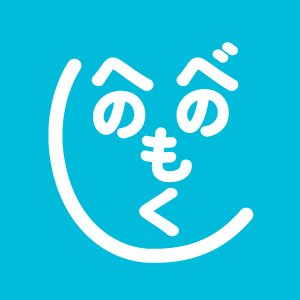
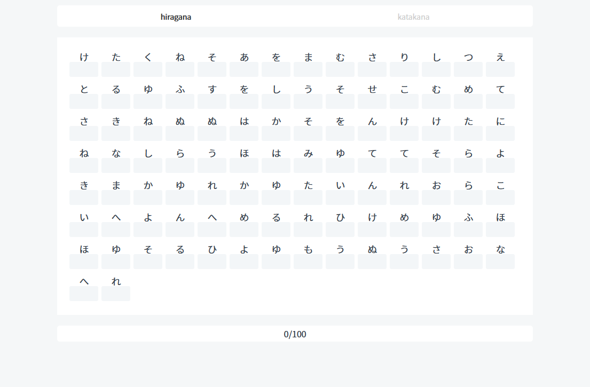
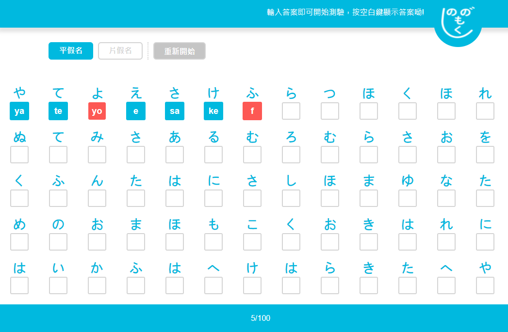
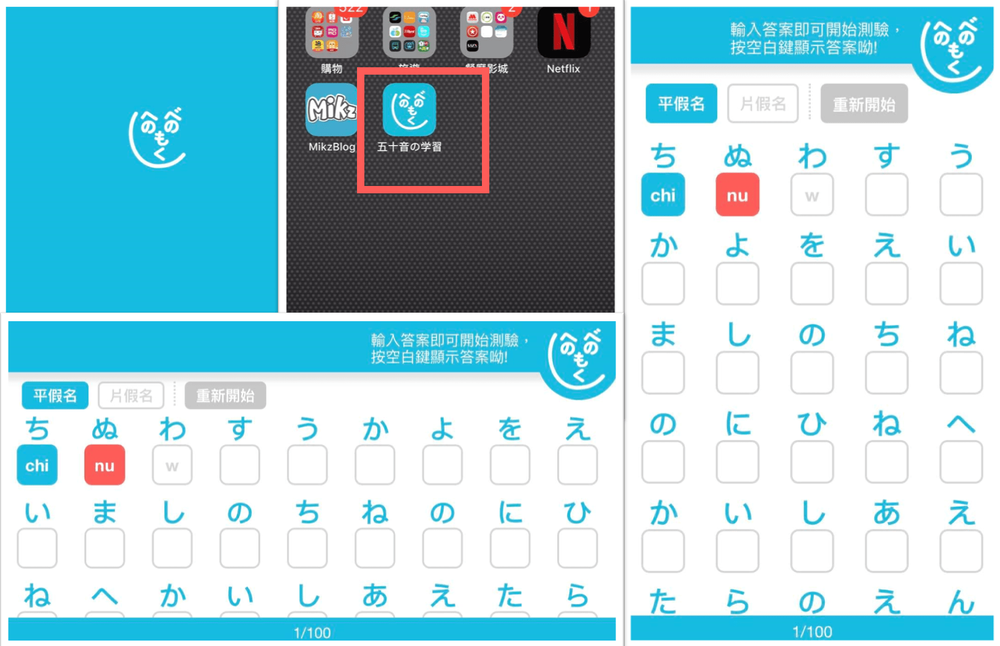

<p align="center">
  <a href="https://mike-zheng.github.io/gojuon" target="_blank" rel="noopener noreferrer">
    <p align="center"></p>
  </a>
</p>

<p align="center">
  
  
  
</p>

> PC Notes:  https://mike-zheng.github.io/posts/gojuon50/

> App Notes:  https://mike-zheng.github.io/posts/gojuonap/

## 五十音の学習ツール

小遊戲性質的羅馬拼音五十音練習。

>2021/06/14
* 遊戲性新介面
* 鍵盤練習為主輸入羅馬英文
* 隨機出題
* 正確失敗提示
* 正確會自動跳題(auto focus)
* 失敗提示後可以透過backspace/del重新輸入
* 忘記了可以按空白鍵投降
* 加入平假名片假名
* 字元支援增強


--------------------------------------
## Installation & Develop

> node -v 14.15.0

``` bash
npm install 

npm run dev
```

--------------------------------------

## Play Ground

**pc** 

https://mike-zheng.github.io/gojuon-exam

**for mobile**
>2021/06/14

https://mike-zheng.github.io/gojuon

# Japanese kana syllabary learning tool. 五十音の学習ツール.

## App Snapshot


**pc** 




**for mobile**
>2021/06/14





